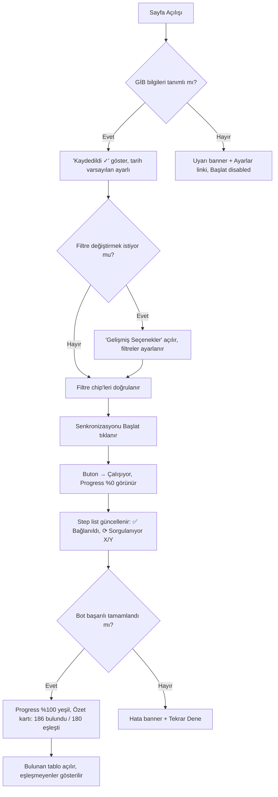
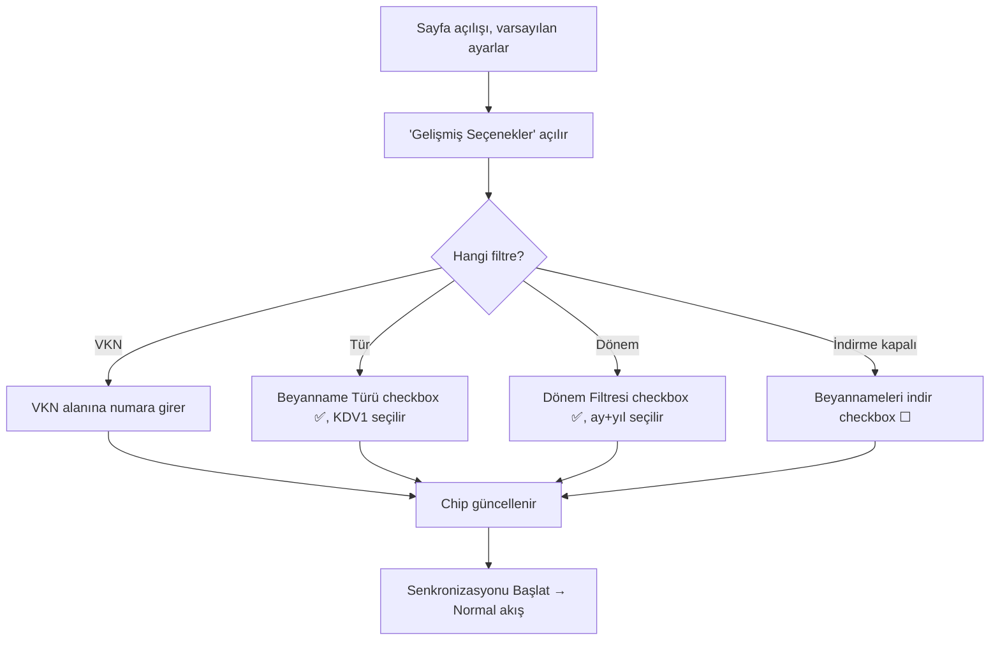
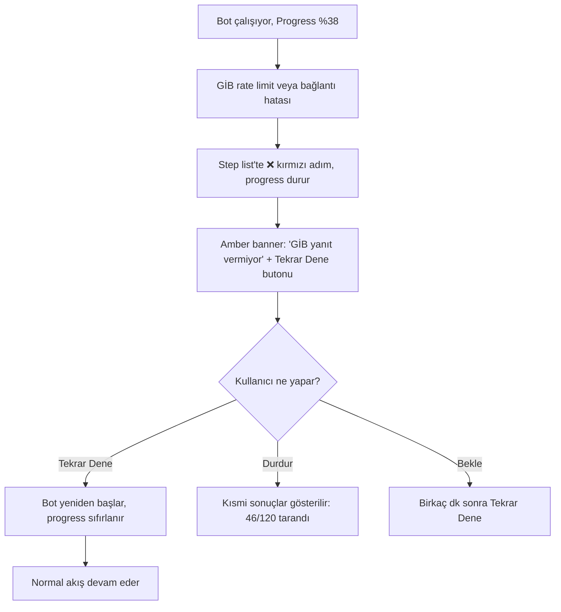
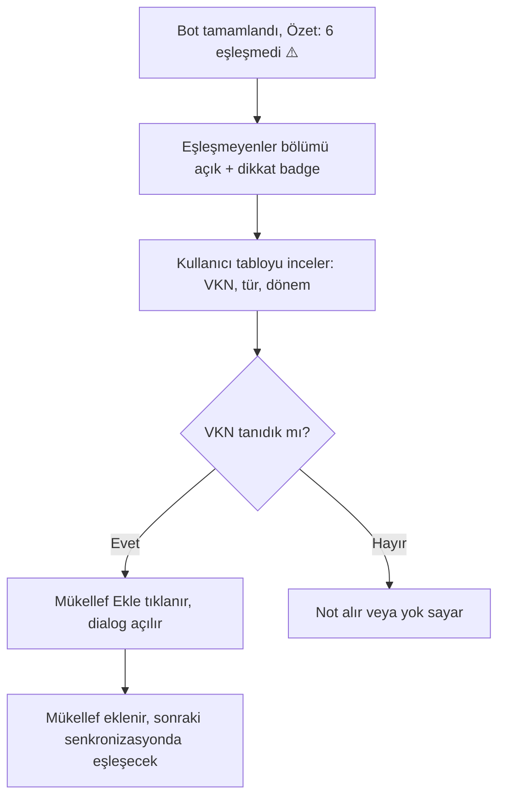

# UX Design Specification — Beyanname Kontrol Sayfa Yeniden Tasarımı

**Yazar:** Safa
**Tarih:** 2026-03-01
**Proje:** SMMM-AI

---

## Executive Summary

### Proje Vizyonu

Beyanname Kontrol sayfası, GİB E-Beyanname sisteminden onaylı beyannameleri otomatik olarak çekip takip çizelgesine işleyen bir bot arayüzüdür. Mevcut tasarım, Mac-style terminal UI ile split-panel layout kullanmakta ve mali müşavirlerin sadelik beklentisini karşılamamaktadır.

Yeniden tasarım hedefi: Terminal UI'ı kaldırıp, beyanname sorgulama sayfasındaki minimal progress yaklaşımını benimseyerek, tek kolonlu, sade ve profesyonel bir arayüz oluşturmaktır.

**KRİTİK KURAL:** Tüm mevcut bot ayarları ve filtreleri korunacak. Sadece sunum şekli değişiyor, fonksiyonellik aynı kalıyor.

### Hedef Kullanıcılar

| Persona | Profil | Beklenti |
|---------|--------|----------|
| Ahmet (Ofis Sahibi) | 45 yaş, 120 mükelef, 20 yıl deneyim | Tek tıkla senkronizasyon, hızlı sonuç |
| Ayşe (Çalışan) | 28 yaş, 40 mükelef, 3 yıl deneyim | Sade arayüz, anında durum bilgisi |

**Ortak özellikler:** Orta teknoloji seviyesi, Excel alışkanlığı, sadelik öncelikli, minimum tıklama beklentisi.

### Korunacak Bot Ayarları (DOKUNULMAYACAK FONKSİYONELLİK)

1. **GİB Giriş Bilgileri** — Kullanıcı kodu, şifre, parola gösterimi
2. **Beyanname Yükleme Tarih Aralığı** — Başlangıç/bitiş tarihi (DatePickerInput)
3. **Mükellef Filtresi** — VKN ve TC Kimlik No ile filtreleme
4. **Beyanname Türü Filtresi** — KDV1, KDV2, MUHSGK vb. checkbox + select
5. **Dönem Filtresi** — Başlangıç/bitiş ay+yıl select'leri
6. **Beyanname İndirme Seçeneği** — İndirme on/off checkbox
7. **Senkronizasyonu Başlat/Durdur** butonları
8. **Bulunan Beyannameler** tablosu
9. **Eşleştirilemeyen Beyannameler** tablosu
10. **Son Taramalar** geçmişi

### Temel Tasarım Zorlukları

1. **Karmaşıklık vs sadelik** — Çok sayıda bot ayarını (tarih, dönem, VKN, beyanname türü, indirme) kullanıcıyı bunaltmadan sunmak
2. **İlerleme gösterimi** — Dakikalarca çalışan bot sürecini profesyonelce, terminal UI olmadan göstermek
3. **Sonuç yönetimi** — Bulunan, eşleşmeyen beyannameler ve geçmişi sekmelere dağıtmadan tek akışta sunmak

### Tasarım Fırsatları

1. **Tek akışlı sayfa** — Beyanname sorgulama referans alınarak, tek kolon yukarıdan aşağı akan layout
2. **Minimal inline progress** — İlerleme çubuğu + adım listesi, detaylı loglar opsiyonel erişimli (collapsible)
3. **Progressive disclosure** — Gelişmiş filtreler varsayılan kapalı, "Gelişmiş Seçenekler" ile erişilebilir

---

## Core User Experience

### Defining Experience

**Temel Kullanıcı Aksiyonu:** Mali müşavir "Senkronizasyonu Başlat" butonuna tıklar ve GİB E-Beyanname sistemindeki onaylı beyannameleri otomatik olarak çekip takip çizelgesine işletir.

Bu aksiyonun tasarım açısından gerektirdikleri:
- Başlat butonu her zaman erişilebilir olmalı — BotControlPanel'den çıkarılıp üst seviyeye alınmalı (scroll gerekmeden)
- Buton durumu net olmalı: Hazır → Çalışıyor → Tamamlandı/Hata
- Tek tıkla başlatma, minimum konfigürasyon ile varsayılan akıllı değerler
- GİB bilgileri zaten tanımlıysa gizlenmeli — sadece "GİB: Kaydedildi ✓" tek satır gösterilmeli (first-time UX)
- Başlatmadan önce seçili ayarların özeti filtre chip'leri ile gösterilmeli: `Son 1 ay | Tüm mükellefler | Tüm türler | İndirme: Açık`

### Platform Strategy

| Özellik | Karar |
|---------|-------|
| Platform | Web (Next.js 15), masaüstü tarayıcı |
| Etkileşim | Mouse + klavye |
| Responsive | Masaüstü öncelikli (1280px+), tablet/mobil önemsiz |
| Çevrimdışı | Gerekli değil — bot Electron üzerinden çalışıyor |
| Performans | Progress güncellemeleri WebSocket üzerinden anlık gelecek |
| Veri hacmi | Max ~1440 satır (120 mükellef × 12 ay), virtualization gerekmez |

### Effortless Interactions

| Zahmetsiz Olması Gereken | Nasıl Sağlanır |
|--------------------------|---------------|
| Bot başlatma | Başlat butonu üst seviyede, scroll gerekmeden erişilebilir |
| İlk izlenim | GİB bilgileri tanımlıysa gizli, sadece "Kaydedildi ✓" gösterilir |
| Ayar kontrolü | Başlatmadan önce filtre özet chip'leri ile seçili ayarlar bir bakışta görülür |
| İlerleme takibi | Minimal progress bar + adım listesi (terminal yok) |
| Sonuçları görme | Bot bitince sonuçlar aynı sayfada otomatik render, collapsible section'lar ile |
| Eşleşmeyenleri tespit | Sonuçlar bölümünde collapsible, dikkat çekici ama panik yaratmayan uyarı |
| Gelişmiş filtre kullanma | "Gelişmiş Seçenekler" collapsible alanı, varsayılan kapalı |
| Tekrar kullanım | Son kullanılan filtre ayarları hatırlanır (localStorage) |
| Geçmiş taramalara bakma | Sayfa altında collapsible geçmiş listesi |
| Detaylı log inceleme | `<details>` pattern'i ile collapsible, varsayılan kapalı |

### Critical Success Moments

1. **"Doğru ayarları seçtim mi?"** anı — Başlat butonunun üstünde filtre özet chip'leri gösterilir, kullanıcı seçimlerini doğrular
2. **"Bu çalışıyor"** anı — Başlat tıklandığında progress bar anında %0'dan başlar, WebSocket bağlantı durumu görünür
3. **"Beyannameler geliyor"** anı — Progress'te bulunan beyanname sayısı gerçek zamanlı artar
4. **"Bu daha iyi"** anı — Tamamlandığında terminal log yığını yerine temiz bir özet kartı: "12 beyanname bulundu, 12 eşleştirildi, 0 hata"
5. **"Sorun var ama anladım"** anı — Eşleşmeyen beyannameler net bir liste ile gösterilir, müdahale butonu (mükellef ekle/eşleştir) mevcut
6. **"Geçmişte ne yaptım"** anı — Son taramalar listesi, tarih + sayı ile hızlı özet

### Experience Principles

1. **Tek Akış İlkesi** — Sekmeler yerine yukarıdan aşağı akan tek sayfa. Kullanıcı tüm bilgiye scroll ile erişir. Bölümler collapsible section'lar ile yönetilebilir uzunlukta tutulur.
2. **Progressive Disclosure** — Temel ayarlar (tarih aralığı + başlat butonu) daima görünür. GİB bilgileri tanımlıysa tek satır "Kaydedildi ✓" olarak gösterilir. Gelişmiş filtreler (VKN, beyanname türü, dönem filtresi) varsayılan kapalı, "Gelişmiş Seçenekler" ile açılır.
3. **Minimal Geri Bildirim** — Terminal UI yerine, beyanname sorgulama sayfasındaki gibi progress bar + adım listesi. Detaylı loglar `<details>` pattern'i ile collapsible, varsayılan kapalı.
4. **Anında Yanıt** — Her kullanıcı aksiyonuna görsel yanıt: buton durumu değişir, progress anında başlar, sonuçlar otomatik render olur.
5. **Bağlam Koruma** — Sonuçlar (bulunan, eşleşmeyen, geçmiş taramalar) aynı sayfada collapsible section'lar olarak akar. Kullanıcı hiçbir zaman sekme değiştirerek bağlam kaybetmez.
6. **Akıllı Varsayılanlar** — Sistem her zaman en olası konfigürasyonu varsayılan olarak sunar. Tarih aralığı otomatik önceki ay, en son kullanılan filtreler hatırlanır (localStorage).

### Component Hierarchy (Hedef Yapı)

```
SmmmAsistanPage (yeni — tek kolon layout)
├── Header (başlık + durum badge)
├── GİB Bilgileri (tanımlıysa: "Kaydedildi ✓" tek satır / eksikse: uyarı)
├── Temel Ayarlar (tarih aralığı — her zaman görünür)
├── Gelişmiş Seçenekler (collapsible — VKN, beyanname türü, dönem, indirme)
├── Filtre Özet Chips (seçili ayarların özeti)
├── Başlat/Durdur Butonu (üst seviye, her zaman erişilebilir)
├── Progress Area (inline progress bar + step list)
├── Sonuçlar: Bulunan Beyannameler (collapsible, otomatik açık)
├── Sonuçlar: Eşleşmeyenler (collapsible, varsa dikkat çekici)
├── Son Taramalar (collapsible, varsayılan kapalı)
└── Detaylı Log (collapsible, varsayılan kapalı)
```

---

## Desired Emotional Response

### Primary Emotional Goals

**Birincil Duygu: Kontrol Hissi**
Mali müşavir, GİB ile etkileşimde normalde belirsizlik yaşar (site yavaş, captcha sorunları, oturum düşmeleri). Bu sayfa, o belirsizliği ortadan kaldırıp **"her şey kontrol altında"** hissi vermelidir.

**İkincil Duygular:**
- **Güven** — "Sistem doğru çalışıyor, verilerim güvende"
- **Verimlilik** — "Normalde 30 dakikamı alan iş 2 dakikada bitti"
- **Rahatlama** — "Tamamlandı, eksik yok"

### Emotional Journey Mapping

| Aşama | Kullanıcı Durumu | Hedef Duygu | Tasarım Yanıtı |
|-------|-----------------|-------------|-----------------|
| **Sayfa açılışı** | "Ne yapacağım?" | Netlik, tanıdıklık | Sade layout, "Kaydedildi ✓", tarih zaten ayarlı |
| **Ayar seçimi** | "Doğru mu seçtim?" | Güven | Filtre özet chip'leri, akıllı varsayılanlar |
| **Başlat tıklama** | "Çalışacak mı?" | Güvence | Buton anında değişir, progress hemen başlar |
| **Süreç devam ediyor** | "Ne oluyor şu anda?" | Kontrol | Progress bar + adım listesi, gerçek zamanlı sayılar |
| **Tamamlandı** | "Sonuç ne?" | Rahatlama, başarı | Özet kart: "12 bulundu, 12 eşleşti" |
| **Eşleşmeyen var** | "Sorun mu var?" | Sakinlik, müdahale gücü | Net liste + "Mükellef Ekle" butonu, panik değil çözüm |
| **Hata oluştu** | "Bozuldu mu?" | Anlama, kontrol | Anlaşılır hata mesajı + "Tekrar Dene" butonu |
| **Tekrar ziyaret** | "Geçen sefer ne oldu?" | Hatırlama | Son taramalar listesi, filtreler hatırlanmış |

### Micro-Emotions

| Duygu Çifti | Hedeflenen | Kaçınılacak | Tasarım Yaklaşımı |
|-------------|-----------|-------------|-------------------|
| **Güven ↔ Şüphe** | Güven | Şüphe | GİB bağlantı durumu görünür, progress adımları şeffaf |
| **Verimlilik ↔ Hayal kırıklığı** | Verimlilik | Hayal kırıklığı | Tek tıklama başlatma, minimum adım |
| **Sakinlik ↔ Endişe** | Sakinlik | Endişe | Hata durumlarında sakin ton, çözüm önerili mesajlar |
| **Başarı ↔ Belirsizlik** | Başarı | Belirsizlik | Tamamlandığında net sayısal özet, bekleneni onaylayan feedback |
| **Tanıdıklık ↔ Yabancılık** | Tanıdıklık | Yabancılık | Beyanname sorgulama sayfasıyla tutarlı pattern, Excel benzeri tablo |

### Design Implications

| Duygusal Hedef | UX Tasarım Yaklaşımı |
|----------------|---------------------|
| **Kontrol** → | İlerleme çubuğu her zaman görünür, durdurmak tek tıklama, filtre chip'leri neyin seçili olduğunu gösterir |
| **Güven** → | "Kaydedildi ✓" rozeti GİB bağlantısını onaylar, sonuçlarda net sayılar (belirsiz ifadeler yok) |
| **Verimlilik** → | Akıllı varsayılanlar sayesinde çoğu zaman hiçbir ayar değiştirmeden "Başlat" tıklanır |
| **Rahatlama** → | Tamamlandığında yeşil başarı kartı, eşleşme oranı, eksik yoksa "Tüm beyannameler eşleştirildi" |
| **Sakinlik (hata)** → | Kırmızı uyarı yerine turuncu-sarı ton, teknik jargon yok, "GİB geçici olarak yanıt vermiyor. Birkaç dakika sonra tekrar deneyin." |
| **Tanıdıklık** → | Tablo yapısı Excel alışkanlığına uygun, beyanname sorgulama sayfası ile tutarlı design language |

### Emotional Design Principles

1. **Şeffaflık güven yaratır** — Süreç sırasında ne olduğu her zaman görünür. "Bağlanıyor… Sayfa 1/5 okunuyor… 8 beyanname bulundu…" gibi adımlar listelenir.
2. **Sakinlik profesyonelliktir** — Hata durumları sakin tonla sunulur. Kırmızı-sarı alarm ikonları yerine, mavi-gri bilgi tonları tercih edilir. Çözüm önerileri her zaman mesajın yanında.
3. **Sayılar güvence verir** — Mali müşavirler sayısal düşünür. "Tamamlandı" yerine "12/12 beyanname eşleştirildi" — net, somut, kontrol edilebilir.
4. **Tanıdık kalıplar rahatlık sağlar** — Beyanname sorgulama sayfası ile aynı design language. Kullanıcı farklı bir dünya hissetmez.
5. **Minimum sürtünme verimlilik hissi verir** — Akıllı varsayılanlar + hatırlanan ayarlar sayesinde çoğu ziyarette sadece "Başlat" tıklanır.

---

## UX Pattern Analysis & Inspiration

### Inspiring Products Analysis

#### 1. Kendi Projemiz: Beyanname Sorgulama Sayfası (beyanname-client.tsx)

**Neden ilham verici:** Aynı kullanıcı kitlesi, aynı proje, zaten çalışan ve beğenilen bir pattern.

| Özellik | Pattern | Neden İşe Yarıyor |
|---------|---------|-------------------|
| Tek kolon layout | `flex flex-col gap-6 p-4 md:p-6` | Sayfa yukarıdan aşağı akar, sekmeler yok |
| Filtreler üstte | Card içinde dönem seçimi + butonlar | Kontrol alanı görünür, tek bakışta kavranır |
| Inline progress | Mavi banner + Loader2 spin + metin | Terminal yok, tek satır durum bilgisi |
| Çoklu yıl progress | Progress bar + yıl bazlı step list + check ikonları | Karmaşık süreci anlaşılır adımlara böler |
| Sonuçlar altında | `BeyannameGroupList` direkt sayfada | Sekme değiştirme yok, sonuç otomatik görünür |
| Boş durum | Büyük ikon + açıklayıcı metin | Kullanıcıyı yönlendirir |
| Hata durumu | Alert + "Tekrar Deneyin" butonu | Çözüm her zaman yanında |

#### 2. Vercel Deployment Dashboard

**Neden ilham verici:** Uzun süren bir süreci (build + deploy) minimal UI ile takip ettiren profesyonel B2B panel.

| Özellik | Pattern | Projemize Uyarlanabilirliği |
|---------|---------|---------------------------|
| Step-by-step progress | Dikey adım listesi + yeşil/mavi/gri durumlar | Bot adımları: Bağlanıyor → Sorgulama → Eşleştirme → Tamamlandı |
| Collapsible log | Her adımın detaylı logu tıklanınca açılır | Detaylı bot logları collapsible area |
| Duration gösterimi | Her adımın yanında süre | "Sorgulama: 45sn" gibi adım süreleri |
| Minimal renk | Yeşil (başarı), mavi (devam), gri (bekliyor) | Aynı 3 renk yeterli |

#### 3. GitHub Actions Workflow Dashboard

**Neden ilham verici:** Birden fazla paralel/sıralı işlemi tek sayfada gösteren, teknik ama okunabilir panel.

| Özellik | Pattern | Projemize Uyarlanabilirliği |
|---------|---------|---------------------------|
| Özet kartı | "X passed, Y failed, Z skipped" tek satırda | "12 bulundu, 10 eşleşti, 2 eşleşmedi" özet kartı |
| Re-run butonu | Başarısız iş tekrar çalıştırılabilir | "Tekrar Dene" butonu hata durumunda |
| Zaman damgası | Her iş için başlangıç + süre | Son taramalar listesinde zaman bilgisi |

#### 4. Parasut.com (Türk Muhasebe SaaS)

**Neden ilham verici:** Aynı hedef kitle (mali müşavirler), Türk SaaS UX convention'ları.

| Özellik | Pattern | Projemize Uyarlanabilirliği |
|---------|---------|---------------------------|
| Türkçe UI dili | Profesyonel ama sade Türkçe | Zaten uyguluyoruz |
| Card-based layout | İlgili bilgiler card'lar içinde gruplu | Ayarlar, sonuçlar, geçmiş ayrı card'larda |
| Badge durum gösterimi | Yeşil/turuncu/kırmızı badge'ler | syncStatus badge'i zaten var |

### Transferable UX Patterns

**Navigation Patterns:**
- **Tek kolon scroll layout** (Beyanname Sorgulama) → Ana sayfa yapısı
- **Collapsible sections** (Vercel) → Gelişmiş seçenekler, sonuçlar, geçmiş

**Interaction Patterns:**
- **Inline progress + step list** (Beyanname Sorgulama çoklu yıl) → Bot ilerleme alanı
- **Collapsible log detail** (Vercel) → Detaylı bot logları
- **Summary card on completion** (GitHub Actions) → Tamamlanma özet kartı
- **Retry button inline** (Beyanname Sorgulama) → Hata durumunda "Tekrar Dene"

**Visual Patterns:**
- **3 renk sistemi** (Vercel) → Yeşil (başarı), mavi (devam), gri (bekliyor)
- **Card grouping** (Parasut) → İlgili bilgiler card içinde
- **Badge status** (mevcut proje) → Bot durumu gösterimi

### Anti-Patterns to Avoid

| Anti-Pattern | Neden Kaçınılmalı | Projemizdeki Karşılığı |
|-------------|-------------------|----------------------|
| **Terminal UI** | Teknik görünüm, mali müşavir için yabancı | Mevcut BotTerminalPanel — KALDIRILACAK |
| **Split panel layout** | Ekranı böler, karmaşıklık artırır | Mevcut 2fr/1fr grid — KALDIRILACAK |
| **Çok sekmeli yapı** | Bağlam kaybı, kullanıcı kaybolur | Mevcut 5 sekme — TEK AKIŞA DÖNÜŞTÜRÜLECEK |
| **Tüm ayarlar açıkta** | Bilgi bombardımanı, "karmaşık" hissi | Mevcut BotControlPanel — PROGRESSIVE DISCLOSURE |
| **Monospace font log** | Teknik hava, "yazılımcı aracı" algısı | Mevcut terminal — MINIMAL PROGRESS ile değiştirilecek |
| **Auto-scroll terminal** | Dikkat dağıtıcı, kontrol hissi azaltır | Mevcut terminal davranışı — KALDIRILACAK |

### Design Inspiration Strategy

**Birebir Benimsenecek:**
- Beyanname Sorgulama'nın tek kolon layout yapısı (`flex flex-col gap-6`)
- Beyanname Sorgulama'nın inline progress pattern'i (mavi banner + loader + metin)
- Beyanname Sorgulama'nın çoklu yıl progress adım listesi pattern'i
- Beyanname Sorgulama'nın hata + "Tekrar Deneyin" butonu pattern'i

**Uyarlanarak Alınacak:**
- Vercel'in collapsible log pattern'i → `<details>` ile basit detaylı log alanı
- Vercel'in step-by-step progress'i → Bot adımları: Bağlanıyor → Sorgulama → Eşleştirme → Tamamlandı
- GitHub Actions'ın özet kartı → Tamamlanma özet kartı: "X bulundu, Y eşleşti, Z eşleşmedi"
- Parasut'un card-based grouping'i → Ayarlar, sonuçlar, geçmiş ayrı card'larda

**Kesinlikle Kaçınılacak:**
- Terminal UI / monospace log akışı (teknik, yabancı)
- Split panel layout (karmaşık, gereksiz)
- 3'ten fazla sekme (bağlam kaybı)
- Tüm filtrelerin aynı anda açık olması (bilgi bombardımanı)

---

## Design System Foundation

### Design System Choice

**Seçim: Themeable System — Radix UI (shadcn/ui) + TailwindCSS 4**

Bu proje zaten tutarlı bir design system kullanıyor. Yeniden tasarım mevcut sistemi aynen benimser, yeni component eklemez — mevcut bileşenlerin composition'ı ile çalışır.

| Katman | Teknoloji | Kullanım |
|--------|-----------|----------|
| **Styling** | TailwindCSS 4 | Utility-first CSS, tüm sayfalarda |
| **Component Library** | Radix UI (shadcn/ui pattern) | `src/components/ui/` — 25+ bileşen |
| **Icons** | Lucide Icons (yeni sayfa için) | Beyanname sorgulama ile tutarlılık |
| **Form** | React Hook Form + Zod | Validasyon ve form yönetimi |
| **Toast** | Sonner | Bildirimler |

### Rationale for Selection

1. **Zaten projede mevcut** — Sıfırdan seçim yapılmasına gerek yok, tutarlılık sağlanır
2. **Referans sayfa (beyanname sorgulama) aynı sistemi kullanıyor** — Birebir uyum
3. **Radix UI accessibility** — Erişilebilirlik dahili olarak destekleniyor
4. **TailwindCSS dark mode** — Mevcut dark mode desteği yeni sayfada da çalışır
5. **Ikon tutarlılığı** — Lucide Icons'a geçiş ile referans sayfa ile uyum sağlanır (mevcut Iconify kaldırılacak)

### Implementation Approach

**Mevcut UI Bileşenleri (kullanılacak):**

| Bileşen | Dosya | Kullanım Amacı |
|---------|-------|---------------|
| `Button` | `ui/button` | Başlat/Durdur butonları |
| `Badge` | `ui/badge` | Durum gösterimi, filtre chip'leri |
| `Select` | `ui/select` | Dönem, beyanname türü seçimi |
| `Input` | `ui/input` | VKN, TC Kimlik No |
| `Checkbox` | `ui/checkbox` | Filtre on/off |
| `Label` | `ui/label` | Form label'ları |
| `DatePickerInput` | `ui/date-picker` | Tarih aralığı seçimi |
| `Alert` | `ui/alert` | Hata ve uyarı mesajları |
| `Collapsible` | `ui/collapsible` | Gelişmiş seçenekler, sonuçlar |

### Customization Strategy

**Renk Sistemi (Bu Sayfa İçin):**

| Durum | Renk | Tailwind Sınıfları | Kullanım |
|-------|------|-------------------|----------|
| **Devam ediyor** | Mavi | `bg-blue-50 text-blue-700 dark:bg-blue-950/30 dark:text-blue-300` | Progress bar, aktif adım |
| **Başarılı** | Yeşil | `bg-green-50 text-green-700 dark:bg-green-950/30 dark:text-green-400` | Tamamlandı, eşleşti |
| **Uyarı** | Amber | `bg-amber-50 text-amber-700 dark:bg-amber-950/20 dark:text-amber-300` | Eşleşmeyenler, dikkat |
| **Hata** | Kırmızı | `bg-red-50 text-red-700 dark:bg-red-950/30 dark:text-red-400` | Bağlantı hatası |
| **Bekliyor** | Gri | `text-muted-foreground border-border` | Henüz başlamamış adım |
| **Bilgi** | Muted | `bg-muted/50 border` | GİB bilgileri, geçmiş |

**Sayfaya Özel Pattern'ler (yeni component değil, composition):**

| Pattern | Çözüm |
|---------|-------|
| Collapsible section with header | Radix `Collapsible` + ChevronDown ikonlu trigger |
| Filter summary chips | `Badge variant="secondary"` bileşenleri |
| Step progress list | Beyanname sorgulama çoklu yıl pattern'inden uyarlama |
| Summary card | Card layout + grid ile basit yapı |

**İkon Geçişi:**
- Mevcut sayfa: Iconify (`@iconify/react`) → **Lucide Icons'a geçilecek**
- Neden: Referans sayfa ile tutarlılık, tree-shakeable, daha hafif bundle

---

## Defining Core Experience

### Defining Experience

**"Başlat'a tıkla, GİB'deki tüm beyannameler otomatik olarak çizelgene işlensin."**

Mali müşavirin normalde 6 adımlı manual süreci (GİB giriş → captcha → E-Beyanname → mükellef arama → kontrol → elle işleme) **tek butona** indirgeniyor.

**Tanıdık metafor:** Excel'de "Tümünü Yenile" butonu — bir kere tıkla, tüm veriler güncellenir, sonucu hemen gör.

### User Mental Model

**Kullanıcının mevcut zihinsel modeli:**

| Mevcut Yaklaşım | Kullanıcı Hissi | Beklenti |
|-----------------|----------------|----------|
| GİB'e manual giriş | Sıkıcı, tekrarlayan | "Bunu benim yerime biri yapsa" |
| Captcha çözme | Sinir bozucu | "Neden her seferinde?" |
| Tek tek mükellef arama | Zaman kaybı | "Hepsini bir seferde görsem" |
| Sonuçları elle çizelgeye işleme | Hata riski | "Otomatik işlense" |

**Kullanıcının bu sayfadan beklentisi:**
- "Bir buton var, basıyorum, her şey halloluyor"
- "Süreç devam ederken ne olduğunu görüyorum"
- "Bitince eksik var mı yok mu hemen anlıyorum"
- "Sorun çıkarsa ne yapacağımı biliyorum"

### Success Criteria

| Kriter | Ölçü | Nasıl Sağlanır |
|--------|------|---------------|
| **Başlatma hızı** | Sayfa açılışından ilk tıklamaya < 3 saniye | Akıllı varsayılanlar, minimum konfigürasyon |
| **Geri bildirim gecikmesi** | İlk progress güncellemesi < 2 saniye | WebSocket ile anlık durum |
| **Anlaşılırlık** | Kullanıcı her an ne olduğunu bilir | Step listesi + sayılar |
| **Tamamlanma netliği** | "Bitti mi?" sorusu hiç sorulmaz | Yeşil özet kartı + sayısal sonuç |
| **Hata çözülebilirliği** | Kullanıcı hatayı kendi çözebilir | Hata mesajı + aksiyon butonu |
| **Tekrar kullanım** | Sonraki ziyarette ayar değiştirmeden başlatabilir | localStorage'da hatırlanan ayarlar |

### Novel UX Patterns

**Karar: %100 Established Patterns**

Bu sayfa yenilikçi etkileşim gerektirmiyor. Tanıdık pattern'ler kullanılacak:

| Pattern | Kaynak | Neden Tanıdık |
|---------|--------|-------------|
| Form + buton | Web standart | Her web kullanıcısı bilir |
| Progress bar + step list | Vercel, GitHub Actions | B2B SaaS'ta yaygın |
| Collapsible sections | Accordion pattern | Yaygın UI pattern |
| Summary card | Dashboard pattern | Sayısal özet kartları |
| Badge status | Her SaaS ürünü | Durum gösterimi |

**Bizim katkımız:** Bu pattern'lerin mali müşavir iş akışına özel **sıralama ve grupla**ması. Yenilik etkileşim biçiminde değil, iş akışına özel uyarlamada.

### Experience Mechanics

**1. Initiation (Başlatma)**
```
Kullanıcı sayfayı açar
├── GİB bilgileri tanımlıysa: "Kaydedildi ✓" (yeşil badge)
├── Tarih aralığı otomatik: önceki ayın 1'i — bugün
├── Filtre chip'leri: "Son 1 ay | Tüm mükellefler | İndirme: Açık"
└── [Senkronizasyonu Başlat] butonu hazır
    └── (isteğe bağlı) "Gelişmiş Seçenekler" açılırsa: VKN, tür, dönem filtreleri
```

**2. Interaction (Etkileşim)**
```
Kullanıcı [Senkronizasyonu Başlat] tıklar
├── Buton → "Çalışıyor..." + spinner'a dönüşür
├── [Botu Durdur] butonu aktif olur
└── Progress area görünür:
    ├── Progress bar: %0 → artmaya başlar
    └── Step list:
        ├── ✓ GİB'e bağlanıldı
        ├── ⟳ Beyannameler sorgulanıyor... (3/120 mükellef)
        ├── ○ Eşleştirme yapılacak
        └── ○ Tamamlanacak
```

**3. Feedback (Geri Bildirim)**
```
Süreç devam ederken:
├── Progress bar: %45 (gerçek zamanlı)
├── Step list güncellenir:
│   ├── ✓ GİB'e bağlanıldı (2sn)
│   ├── ⟳ Beyannameler sorgulanıyor... (54/120 mükellef, 186 beyanname bulundu)
│   ├── ○ Eşleştirme yapılacak
│   └── ○ Tamamlanacak
└── (opsiyonel) Detaylı log collapsible alanda

Hata durumunda:
├── Step list'te hata adımı kırmızı
├── Amber banner: "GİB geçici olarak yanıt vermiyor"
└── [Tekrar Dene] butonu yanında
```

**4. Completion (Tamamlanma)**
```
Bot tamamlandığında:
├── Progress bar: %100 (yeşil)
├── Özet kartı:
│   ├── "186 beyanname bulundu"
│   ├── "180 çizelgeye eşleştirildi"
│   ├── "6 eşleştirilemedi" (amber)
│   └── "Süre: 2dk 45sn"
├── Bulunan Beyannameler tablosu (collapsible, otomatik açık)
├── Eşleşmeyenler listesi (collapsible, varsa dikkat çekici badge ile)
└── [Yeni Tarama Başlat] butonu
```

---

## Visual Design Foundation

### Color System

**Mevcut Proje Renk Sistemi (globals.css — OKLCH):**

| Token | Light | Dark | Kullanım |
|-------|-------|------|----------|
| `--primary` | `oklch(0.45 0.2 250)` (mavi) | `oklch(0.55 0.2 250)` | Ana aksiyon rengi |
| `--background` | `oklch(1 0 0)` (beyaz) | `oklch(0.145 0 0)` (koyu) | Sayfa arka planı |
| `--card` | `oklch(1 0 0)` | `oklch(0.205 0 0)` | Card arka planları |
| `--muted` | `oklch(0.97 0 0)` | `oklch(0.269 0 0)` | İkincil alanlar |
| `--destructive` | `oklch(0.577 0.245 27)` | `oklch(0.704 0.191 22)` | Hata durumları |
| `--border` | `oklch(0.922 0 0)` | `oklch(1 0 0 / 10%)` | Kenar çizgileri |

**Sayfaya Özel Durum Renkleri:**

| Durum | Tailwind Sınıfları |
|-------|-------------------|
| Devam ediyor | `bg-blue-50 text-blue-700` / `dark:bg-blue-950/30 dark:text-blue-300` |
| Başarılı | `bg-green-50 text-green-700` / `dark:bg-green-950/30 dark:text-green-400` |
| Uyarı | `bg-amber-50 text-amber-700` / `dark:bg-amber-950/20 dark:text-amber-300` |
| Hata | `destructive` token veya `bg-red-50 text-red-700` / `dark:bg-red-950/30 dark:text-red-400` |

### Typography System

**Font:** Inter (`--font-inter` → `--font-sans`)
**Base:** `clamp(0.875rem, 0.8rem + 0.2vw, 1rem)` — 14px–16px fluid

| Element | Sınıf | Kullanım |
|---------|-------|----------|
| Sayfa başlığı | `text-2xl font-bold tracking-tight` | "Beyanname Kontrol" |
| Bölüm başlığı | `text-sm font-semibold` | "GİB Bilgileri", "Gelişmiş Seçenekler" |
| Label | `text-xs font-medium text-muted-foreground` | Form label'ları |
| Body | `text-sm` | Tablo satırları, açıklamalar |
| Yardımcı | `text-xs text-muted-foreground` | Alt açıklamalar |
| Progress | `text-sm font-medium` | "Sorgulanıyor... (54/120)" |
| Özet sayılar | `text-2xl font-bold` | "186" beyanname bulundu |
| Monospace | `font-mono text-xs` | VKN, TC Kimlik numaraları |

### Spacing & Layout Foundation

**Spacing:** TailwindCSS 4px grid

```
Sayfa: flex flex-col gap-6 p-4 md:p-6
├── Card'lar: rounded-lg border bg-card p-4 shadow-sm
├── Section'lar arası: gap-6 (24px)
├── Card içi: gap-4 (16px)
└── Form elementleri: gap-2 (8px) veya gap-3 (12px)
```

**Border radius:** `--radius: 0.625rem` (10px)
**Shadow:** Tema bazlı — `theme-default` gölgeli, `theme-flat` gölgesiz

### Accessibility Considerations

| Gereklilik | Çözüm |
|-----------|-------|
| Renk kontrastı | OKLCH token'lar yüksek kontrast sağlıyor |
| Keyboard navigation | Radix UI dahili destek |
| Screen reader | Label + aria-label uygulanacak |
| Focus states | `outline-ring/50` global tanımlı |
| Dark mode | Tüm durum renkleri dark variant'lı |
| Responsive font | `clamp()` ile fluid typography |

---

## Design Direction Decision

### Design Directions Explored

Bu proje mevcut bir uygulamanın sayfa yeniden tasarımı olduğundan, birden fazla görsel yön yerine **tek yönün farklı sayfa durumları** wireframe olarak tasarlandı:

1. **Durum: Idle (Başlangıç)** — Ayarlar görünür, boş durum mesajı, başlat butonu hazır
2. **Durum: Gelişmiş Seçenekler Açık** — Collapsible alan açılmış, ek filtreler görünür
3. **Durum: Running (Çalışıyor)** — Ayarlar daraltılmış, progress bar + step list aktif
4. **Durum: Completed (Tamamlandı)** — 3'lü özet kartı, bulunan/eşleşmeyen tablolar, geçmiş
5. **Durum: Error (Hata)** — Amber hata banner + tekrar dene butonu, yarıda kalan progress

### Chosen Direction

**Tek kolon, durum bazlı adaptive layout:**

- Sayfa her zaman tek kolon dikey akış
- Bot durumuna göre bölümler otomatik gösterilir/gizlenir
- Running durumunda ayar bölümü daraltılır, odak progress'e kayar
- Completed durumunda 3'lü özet kartı + collapsible sonuç tabloları
- Hata mesajı + çözüm butonu her zaman aynı satırda

### Design Rationale

| Karar | Gerekçe |
|-------|---------|
| Tek kolon, dikey akış | Beyanname sorgulama ile tutarlı, sekmesiz |
| Running durumunda ayarlar daraltılıyor | Odak progress'e kayıyor, ekran alanı verimli |
| 3'lü özet kartı (Bulundu/Eşleşti/Eşleşmedi) | GitHub Actions pattern'i, bir bakışta sonuç |
| Collapsible sonuç tabloları | Sayfa uzunluğu yönetilebilir |
| Hata + Tekrar Dene aynı satırda | Çözüm her zaman görünür |
| Detaylı log en altta, varsayılan kapalı | Terminal yerine minimal erişim |

### Wireframes

**Idle State:**
```
Header + Badge(Hazır)
GİB: Kaydedildi ✅  [Ayarları Düzenle →]
Tarih: [Başlangıç] — [Bitiş]
▶ Gelişmiş Seçenekler
Chip'ler: Son 1 ay · Tüm mükellefler · İndirme: Açık
[Senkronizasyonu Başlat]
Boş durum mesajı
```

**Running State:**
```
Header + Badge(⟳ Çalışıyor)
GİB ✅ · Tarih: 01.02—01.03 (daraltılmış)
[Botu Durdur]
Progress: ████████░░░░ %38
  ✅ GİB'e bağlanıldı (2sn)
  ⟳ Sorgulanıyor... (46/120, 134 bulundu)
  ○ Eşleştirme
  ○ Tamamlanma
▶ Detaylı Log
```

**Completed State:**
```
Header + Badge(✅ Tamamlandı)
[Yeni Tarama Başlat]
Özet: [186 Bulundu] [180 Eşleşti] [6 Eşleşmedi] — 2dk 45sn
▼ Bulunan Beyannameler (186) — tablo
▼ Eşleşmeyenler (6) ⚠️ — tablo + [Mükellef Ekle]
▶ Son Taramalar (5)
▶ Detaylı Log
```

**Error State:**
```
Header + Badge(❌ Hata)
⚠️ "GİB yanıt vermiyor" [Tekrar Dene]
Progress: ████████░░░ %25
  ✅ Bağlanıldı
  ❌ Sorgu başarısız
  ○ Eşleştirme
  ○ Tamamlanma
```

---

## User Journey Flows

### Journey 1: Standart Senkronizasyon (Happy Path)

En sık kullanılan akış — mali müşavir sayfayı açar, başlatır, sonucu görür.



**Tıklama sayısı:** Minimum 1 (sadece Başlat), maksimum 3 (filtre aç + ayarla + başlat)

### Journey 2: Filtrelenmiş Senkronizasyon

Ayşe (çalışan) belirli mükellef veya beyanname türünü hedefler.



### Journey 3: Hata Kurtarma

Bot çalışırken GİB hatası oluşur.



### Journey 4: Eşleşmeyen Beyanname Çözümü

Bot tamamlandı ama bazı beyannameler eşleşmedi.



### Journey Patterns

| Pattern | Açıklama | Kullanım |
|---------|----------|----------|
| **Instant Feedback** | Her aksiyona < 200ms görsel yanıt | Buton state, progress başlangıcı |
| **Progressive Results** | Sonuçlar kısmi olarak gösterilir | Sayılar gerçek zamanlı artar |
| **Error + Action** | Her hata yanında çözüm butonu | "GİB yanıt vermiyor" + [Tekrar Dene] |
| **Smart Defaults** | Varsayılanlar en olası senaryoya ayarlı | Tarih = önceki ay, tüm mükellefler |
| **Collapsible Detail** | Ana bilgi görünür, detay istenirse açılır | Gelişmiş seçenekler, log |

### Flow Optimization Principles

1. **Minimum Step to Value** — Çoğu kullanıcı tek tıklama ile başlatabilmeli
2. **No Dead Ends** — Her hata durumunda ileriye dönük aksiyon mevcut
3. **Context Preservation** — Kullanıcı sayfa dışına yönlendirilmez
4. **Progressive Complexity** — Temel akış basit, gelişmiş özellikler opsiyonel
5. **Partial Success** — Bot yarıda kalsa bile bulunan sonuçlar gösterilir

---

## Component Strategy

### Design System Components

Mevcut UI kit'ten kullanılacak bileşenler:

| Bileşen | Kullanım Yeri | State'ler |
|---------|--------------|-----------|
| `Button` | Başlat/Durdur/Tekrar Dene/Yeni Tarama | default, loading, destructive |
| `Badge` | syncStatus, filtre chip'leri, "Kaydedildi ✓" | outline, secondary, renk varyantları |
| `Collapsible` | Gelişmiş seçenekler, sonuç tabloları, log, geçmiş | open/closed |
| `Select` | Dönem ay/yıl, beyanname türü | default, disabled |
| `Input` | VKN, TC Kimlik No | default, disabled, monospace |
| `Checkbox` | Beyanname türü, dönem, indirme filtreleri | checked/unchecked, disabled |
| `Label` | Tüm form alanları | default, muted |
| `DatePickerInput` | Tarih aralığı | default, minDate/maxDate |
| `Alert` | Hata mesajları | destructive variant |

### Custom Components

#### 1. GibStatusBadge (JSX composition — ayrı dosya gerekmez)

GİB kimlik durumunu tek satırda gösterir:
- Tanımlıysa: `✅ GİB: Kaydedildi` + `[Ayarları Düzenle →]`
- Eksikse: `⚠️ GİB bilgileri eksik` + `[Ayarlar →]` (amber banner)

#### 2. FilterSummaryChips (JSX composition — ayrı dosya gerekmez)

Seçili filtrelerin özetini badge'ler ile gösterir:
`Son 1 ay · Tüm mükellefler · Tüm türler · İndirme: Açık`

Badge variant="secondary" bileşenlerinin sıralı render'ı.

#### 3. BotProgressArea (Ayrı component dosyası)

**Dosya:** `src/components/beyanname-kontrol/bot-progress-area.tsx`

Bot sürecinin ilerleme durumunu gösterir: progress bar + step list + collapsible log.

```typescript
interface BotStep {
  label: string;           // "GİB'e bağlanıldı"
  status: 'done' | 'running' | 'pending' | 'error';
  detail?: string;         // "(54/120 mükellef)"
  duration?: number;       // Saniye
}

interface BotProgressAreaProps {
  progress: number;        // 0-100
  steps: BotStep[];
  logs: string[];
  status: 'running' | 'completed' | 'error';
}
```

State'ler: running (mavi), completed (yeşil %100), error (kırmızı adım)

#### 4. SyncSummaryCard (JSX composition — ayrı dosya gerekmez)

3'lü özet kartı: Bulundu (mavi) / Eşleşti (yeşil) / Eşleşmedi (amber) + süre.

### Component Implementation Strategy

| Bileşen | Tip | Dosya | Öncelik |
|---------|-----|-------|---------|
| GibStatusBadge | JSX composition | SmmmAsistanPage içinde | P1 |
| FilterSummaryChips | JSX composition | SmmmAsistanPage içinde | P1 |
| BotProgressArea | Ayrı component | `bot-progress-area.tsx` | P1 |
| SyncSummaryCard | JSX composition | SmmmAsistanPage içinde | P1 |
| Collapsible sonuç tabloları | Radix wrapper | Mevcut tab'lar uyarlanır | P2 |
| Detaylı log alanı | `<details>` HTML | Inline JSX | P3 |

### Implementation Roadmap

**Tek Faz (sayfa yeniden tasarımı):**

1. `SmmmAsistanPage` yeniden yazılır — tek kolon layout
2. `BotProgressArea` component oluşturulur (yeni dosya)
3. `BotControlPanel` → Gelişmiş Seçenekler collapsible'a sarılır
4. Başlat/Durdur butonu üst seviyeye alınır
5. Tab içerikleri → inline collapsible section'lara dönüşür
6. `BotTerminalPanel` kaldırılır
7. `TerminalContext` kaldırılır

**Korunan dosyalar (değiştirilmez):**
- `bot-control-panel.tsx` — Ayar UI'ı aynen kalır
- `use-bot-connection.ts` — Bot hook'u aynen kalır
- `bot-result-context.tsx` — Cross-page persistence
- `bot-log-context.tsx` — Log verileri

---

## UX Consistency Patterns

### Button Hierarchy

| Buton | Variant | Boyut | Ne Zaman Görünür |
|-------|---------|-------|-----------------|
| **Senkronizasyonu Başlat** | `default` (primary) | `lg`, `w-full` | idle/success/error |
| **Botu Durdur** | `destructive` | `lg`, `w-full` | running |
| **Tekrar Dene** | `outline` | `default` | Hata durumunda, alert içinde |
| **Ayarları Düzenle** | `link` (text) | `sm` | GİB bilgileri yanında |
| **Mükellef Ekle** | `outline` | `sm` | Eşleşmeyenler tablosunda |

Kurallar: Sayfada aynı anda max 1 primary buton. GİB eksikse Başlat disabled.

### Feedback Patterns

| Durum | Görünüm | Ton | Örnek |
|-------|---------|-----|-------|
| **Başarı** | Yeşil banner veya toast | Rahatlatıcı | "186 beyanname eşleştirildi" |
| **Hata** | Amber banner + aksiyon butonu | Sakin, çözüm odaklı | "GİB yanıt vermiyor" + [Tekrar Dene] |
| **Kritik hata** | Alert destructive | Ciddi | "GİB bilgileri hatalı" + [Ayarlar →] |
| **Uyarı** | Amber badge + collapsible | Dikkat çekici | "6 beyanname eşleştirilemedi" ⚠️ |
| **Bilgi** | Mavi banner + spinner | Nötr | "Sorgulanıyor... (54/120)" |
| **Boş durum** | Büyük ikon + açıklama | Yönlendirici | "Başlat butonuna tıklayın" |

Kurallar: Kırmızı sadece destructive buton ve kritik hatalar için. Genel hatalar amber. Her hata yanında çözüm aksiyonu.

### Form Patterns

| Pattern | Uygulama |
|---------|----------|
| Disabled durumu | Bot çalışırken tüm input'lar disabled |
| Mutual exclusion | VKN girilirse TC temizlenir (ve tersi) |
| Validation | Tarih aralığı max 31 gün |
| Default values | Tarih = önceki ayın 1'i — bugün |
| Label pattern | `text-xs font-medium text-muted-foreground` |
| Help text | `text-xs text-muted-foreground` altında |

### State Management Patterns

syncStatus'a göre UI bölümlerinin görünürlüğü:

| Bölüm | idle | running | completed | error |
|-------|------|---------|-----------|-------|
| GİB Status | Görünür | Daraltılmış | Daraltılmış | Görünür |
| Tarih Aralığı | Görünür | Daraltılmış | Daraltılmış | Görünür |
| Gelişmiş Seçenekler | Erişilebilir | Gizli | Gizli | Erişilebilir |
| Filtre Chip'leri | Görünür | Özet | Özet | Görünür |
| Başlat Butonu | Aktif | → Durdur | → Yeni Tarama | Aktif |
| Progress Area | Gizli | Görünür | Yeşil %100 | Kırmızı adım |
| Özet Kartı | Gizli | Gizli | Görünür | Kısmi özet |
| Bulunan Tablo | Gizli | Gizli | Otomatik açık | Kısmi sonuç |
| Eşleşmeyenler | Gizli | Gizli | Varsa görünür | Gizli |
| Son Taramalar | Görünür | Gizli | Görünür | Görünür |
| Detaylı Log | Gizli | Collapsible | Collapsible | Collapsible |
| Hata Banner | Gizli | Gizli | Gizli | Görünür |

### Collapsible Section Pattern

Tüm collapsible bölümler aynı pattern:

```
▶ Bölüm Başlığı (adet)     ← Kapalı
▼ Bölüm Başlığı (adet)     ← Açık
  └── İçerik
```

- Trigger: `flex items-center justify-between w-full`
- İkon: `ChevronDown` — açıkken 180° rotate, `transition-transform duration-200`
- Badge: Sağ tarafta `Badge variant="secondary"` ile adet

---

## Responsive Design & Accessibility

### Responsive Strategy

**Desktop-First Yaklaşım**

Bu sayfa masaüstü tarayıcıda kullanılır. Bot süreci Electron üzerinden çalıştığı için kullanıcı zaten masaüstünde oturmaktadır.

| Cihaz | Strateji | Öncelik |
|-------|----------|---------|
| **Masaüstü (1280px+)** | Tam deneyim, tek kolon max-width container | Birincil |
| **Laptop (1024–1279px)** | Aynı layout, biraz sıkışık padding | Desteklenir |
| **Tablet (768–1023px)** | Tek kolon devam, form elementleri stack | Temel destek |
| **Mobil (<768px)** | Kapsam dışı — mali müşavir bu sayfayı telefondan kullanmaz | Yok |

**Desktop Layout:**
- `max-w-4xl mx-auto` — İçerik 896px ile sınırlı, geniş ekranlarda ortalanmış
- `p-4 md:p-6` — Mobilde 16px, masaüstünde 24px padding
- Tüm form elementleri tek kolondan akar, yan yana grid gerekmez

**Tablet Adaptasyonu:**
- Gelişmiş Seçenekler içindeki 2 kolonlu grid → tek kolona düşer
- DatePickerInput'lar stack olur (`flex-col` yerine `flex-row`)
- Tablo yatay scroll alır (mevcut pattern)

### Breakpoint Strategy

**TailwindCSS 4 Varsayılan Breakpoint'leri (Değişiklik yok):**

| Breakpoint | Min-width | Bu Sayfa İçin |
|------------|-----------|---------------|
| `sm` | 640px | — |
| `md` | 768px | Padding artışı, form layout |
| `lg` | 1024px | — |
| `xl` | 1280px | — |

**Kullanım:**
```
flex flex-col gap-6 p-4 md:p-6     → Sayfa container
grid grid-cols-1 md:grid-cols-2    → Gelişmiş Seçenekler içi (tarih çiftleri)
w-full md:w-auto                   → Butonlar
```

Özel breakpoint gerekmez. TailwindCSS varsayılanları yeterli. `md:` prefix'i tek geçiş noktası olarak kullanılır.

### Accessibility Strategy

**WCAG 2.1 Level AA Uyumluluğu**

Radix UI bileşenleri zaten AA uyumlu. Bu avantajı koruyarak ek maliyet olmadan erişilebilir bir sayfa sunuyoruz.

**Renk Kontrastı:**

| Öğe | Foreground | Background | Oran | Durum |
|-----|-----------|-----------|------|-------|
| Body text (light) | `oklch(0.145)` | `oklch(1)` | ~15:1 | ✅ AA |
| Muted text (light) | `oklch(0.556)` | `oklch(1)` | ~4.6:1 | ✅ AA |
| Primary button | `oklch(0.985)` | `oklch(0.45)` | ~7:1 | ✅ AA |
| Success (green) | `text-green-700` | `bg-green-50` | ~5.5:1 | ✅ AA |
| Warning (amber) | `text-amber-700` | `bg-amber-50` | ~5.2:1 | ✅ AA |
| Error (red) | `text-red-700` | `bg-red-50` | ~5.8:1 | ✅ AA |

**Keyboard Navigation:**

| Aksiyon | Tuş | Davranış |
|---------|-----|----------|
| Başlat/Durdur | `Enter` / `Space` | Odaklı buton tetiklenir |
| Gelişmiş Seçenekler aç/kapa | `Enter` / `Space` | Collapsible trigger |
| Filtreler arası gezinme | `Tab` | Doğal form sırası |
| Select açma | `Enter` / `Space` / `ArrowDown` | Radix Select davranışı |
| Checkbox toggle | `Space` | Radix Checkbox davranışı |
| Collapsible section aç/kapa | `Enter` / `Space` | Trigger'da focus varken |

**Screen Reader Desteği:**

| Bölge | ARIA | Açıklama |
|-------|------|----------|
| Progress bar | `role="progressbar"` + `aria-valuenow` + `aria-valuemin/max` | "%38 tamamlandı" |
| Step list | `aria-label="Senkronizasyon adımları"` | Adım durumları okunur |
| Collapsible trigger | `aria-expanded` (Radix dahili) | "Gelişmiş Seçenekler, kapalı" |
| Hata banner | `role="alert"` | Otomatik okunur |
| Başarı özeti | `role="status"` + `aria-live="polite"` | Tamamlandığında duyurulur |
| Bot durumu badge | `aria-label="Senkronizasyon durumu: Çalışıyor"` | Durum açıklaması |
| Disabled butonlar | `aria-disabled="true"` | Neden disabled olduğu tooltip'te |
| GİB bilgileri | `aria-label="GİB giriş bilgileri kaydedildi"` | Durum net |

**Focus Yönetimi:**

| Olay | Focus Davranışı |
|------|----------------|
| Başlat tıklandığında | Focus progress area'ya kayar |
| Bot tamamlandığında | Focus özet kartına kayar |
| Hata oluştuğunda | Focus hata banner'ına kayar |
| Collapsible açıldığında | Focus içerik alanına kayar |
| Dialog açıldığında | Focus dialog içine trap olur (Radix dahili) |

### Testing Strategy

**Responsive Testing:**

| Test | Araç | Sıklık |
|------|------|--------|
| Viewport boyutları | Chrome DevTools responsive mode | Her değişiklikte |
| 1280px, 1024px, 768px | DevTools preset'leri | Geliştirme sırasında |
| Gerçek cihaz (tablet) | Opsiyonel | Büyük değişikliklerde |

**Accessibility Testing:**

| Test | Araç | Sıklık |
|------|------|--------|
| Otomatik audit | Chrome DevTools Lighthouse | Her release'den önce |
| ARIA doğrulama | axe DevTools eklentisi | Geliştirme sırasında |
| Keyboard navigation | Manuel test | Her yeni bileşende |
| Kontrast kontrolü | Chrome DevTools kontrast aracı | Renk değişikliklerinde |
| Screen reader | NVDA (Windows) | Büyük değişikliklerde |

**Test Kontrol Listesi:**

- [ ] Tüm form elementleri Tab ile erişilebilir
- [ ] Progress bar screen reader'da okunuyor
- [ ] Hata mesajları `role="alert"` ile otomatik duyuruluyor
- [ ] Collapsible section'lar keyboard ile açılıp kapanıyor
- [ ] Dark mode'da tüm renkler okunabilir
- [ ] 768px'de layout kırılmıyor
- [ ] Butonların touch target'ı min 44x44px

### Implementation Guidelines

**Responsive Geliştirme:**

```typescript
// Sayfa container
<div className="flex flex-col gap-6 p-4 md:p-6 max-w-4xl mx-auto">

// Gelişmiş Seçenekler içi — tarih çiftleri
<div className="grid grid-cols-1 md:grid-cols-2 gap-4">

// Buton genişliği
<Button className="w-full md:w-auto">

// Tablo — yatay scroll
<div className="overflow-x-auto">
  <Table>...</Table>
</div>
```

**Accessibility Geliştirme:**

```typescript
// Progress bar
<div
  role="progressbar"
  aria-valuenow={progress}
  aria-valuemin={0}
  aria-valuemax={100}
  aria-label={`Senkronizasyon ilerleme: %${progress}`}
>
  <div style={{ width: `${progress}%` }} />
</div>

// Step list
<ul aria-label="Senkronizasyon adımları">
  <li aria-current={step.status === 'running' ? 'step' : undefined}>
    {step.label}
  </li>
</ul>

// Hata banner — otomatik screen reader duyurusu
<Alert role="alert">
  GİB geçici olarak yanıt vermiyor
  <Button>Tekrar Dene</Button>
</Alert>

// Başarı özeti — polite duyuru
<div role="status" aria-live="polite">
  186 beyanname bulundu, 180 eşleştirildi
</div>

// Collapsible — Radix otomatik aria-expanded
<Collapsible>
  <CollapsibleTrigger>
    Gelişmiş Seçenekler
  </CollapsibleTrigger>
  <CollapsibleContent>...</CollapsibleContent>
</Collapsible>
```

**Genel Kurallar:**

1. Relative birimler kullan (`rem`, `%`) — sabit `px` sadece border ve ikon boyutu için
2. `clamp()` ile fluid typography zaten globals.css'te tanımlı — ek ayar gerekmez
3. Görsel-only bilgileri `aria-label` ile açıkla (✅, ⟳, ○ ikonları)
4. `disabled` state'lerde `aria-disabled` + `title` ile neden açıkla
5. Renk tek başına bilgi taşımasın — her durumda ikon + metin de olsun (renk körlüğü)
